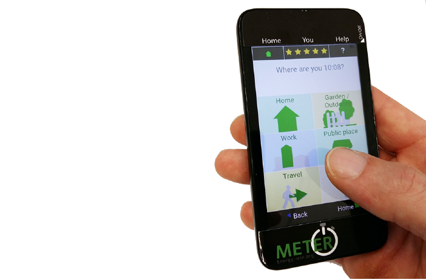
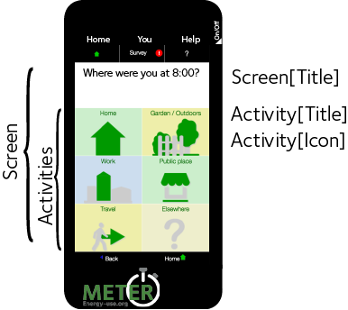
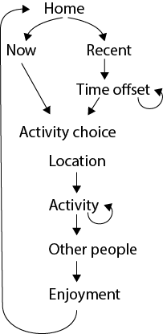

=================
Activity Recorder
=================

The Meter_ Activity Recorder records everyday household activities. The app is Cordova based and pre-installed on Android Devices, for Meter_ project participants to submit activity and individual information through a 
simple interface. The app can also be used to code up hand written
activity booklets. The code and dependent data is available in this `gitHub
repository <https://github.com/PhilGrunewald/MeterApp>`__.

.. _Meter: http://www.energy-use.org

This document explains

-  Revisions
-  The App structure
-  The tree structure of activity selection
-  The navigation logic between activities and screens
-  The code base

Revision History
================

1 Nov 2017 | introduced branch 'german' in www/json

7 Nov 2017 | v2.0.2: changed "How many people are you with" > "How many people are you doing this with"

23 Jan 2018 | introduction to Cordova setup (1st draft)

App interface
=============

The app is build around a html5 user interface consisting of the
following sections:

1. **Navigation bar** (navbar): Three buttons at the top of the screen.

-  **Home**: navigate to the ActivityList where current activities can
   be seen and new ones added.
-  **Survey**: navigate to the Survey ('About Me'), where information
   about the individual should be entered.
-  **Help**: navigate to a selection of video and written instructions.

2. **Header** (header): The region where the question (e.g. "What are
   you doing?") is displayed

3. **Activity List** (activity\_list\_pane): Shown on 'home' screen.

-  **Add new activity** (btn-addnew): Buttons to add new activity (time
   stamped as now) and 'recent' activity, which opens a 'how long ago'
   dialogue.
-  **Catch up list** (catchup-list): List of past times for which an
   entry is encouraged (times like 5:30pm, 6pm, 8am).
-  **Lists of activities** (activity-list): Currently live activities.
   Can be removed when completed.

4. **Choices** (choices): A 2 by 3 array of buttons populated by the
   navigateTo function. Each button navigates to a new screen.

5. **Footer** (footer-nav): Two buttons to aid navigation. Left for
   'back', right for 'done'.

.. raw:: html

   <!-- 
   
   
   -->

   Standard layout

.. figure:: /docs/ActivityScreens.png
   :alt: Activity Screens

   The Home Screen (a) and Choice Screens (b-e). The Activities pane always follows the standard 2x3 button layout

Activity navigation
===================

Activity entries follow a common sequence shown in Figure 3.

   Entry sequence for activities

Each screen, other than the *home screen* (Figure 1) is structured as
shown in Figure 2 with six choice buttons. Screens are populated from
the file
`screens.json <https://github.com/PhilGrunewald/MeterApp/blob/master/www/js/screens.json>`__.

.. code:: json

            "activity root": {
                "title": "Where are you at ${time}?",
                "help": "Your location.",
                "activities": [
                    "Loc home",
                    "Loc work",
                    "Loc travelling",
                    "Loc friends",
                    "Loc outdoors",
                    "Loc other location"
                ]
            }

``"activity root"`` is the ``screen_id`` by which the screen is
identified. The Meter naming convention is for screens to be lower case,
to tell them apart more easily from ``activities``, which are preferably
upper case.

The ``"title"`` string is displayed in the ``Header``, ``"help"`` text
is displayed when ``Help`` is toggled on in the ``Navigation bar``.

The six buttons in ``Choices`` are populated based on the array
``"activities"``. Each of those strings (``"Loc home", "Loc work"...``)
are keys for
`activities.json <https://github.com/PhilGrunewald/MeterApp/blob/master/www/js/activities.json>`__.
In this file activities are represented as follows:

.. code:: json

            "Loc home": {
                "title": "meter: location home",
                "icon": "home",
                "caption": "Home",
                "help": "In or around your home / garden",
                "ID": 30011,
                "value": 1,
                "category": "care_self",
                "next": "activity main"
            }

``"Loc home"`` is the unique lookup key for this activity. The button is
populated with ``"caption"`` text and optionally can have an ``"icon"``
with ``.png`` as the default extension. The ``"title"`` string is the
text that will be stored as the activity description in the database and
can be more expansive than the caption, for instance to explain the
'path' by which the activity was selected.

As with ``screen.json``, the ``"help"`` text is only displayed when
``Navigation bar > Help`` is toggled on.

Time use code values are stored under ``"ID"``. These values are based
on HETUS (the Harmonised European Time Use Survey), but several
extensions have been made. Code ranges are explained in Section XXX Code
Ranges.

Not all activities have a ``"value"``. These are used for numerical
coding in some cases (location, enjoyment and for time adjustments where
values represent minutes).

The ``"category"`` value identifies the main types of activity:

.. code:: javascript

            var CATEGORIES = [
                "care_self",
                "care_other",
                "care_house",
                "recreation",
                "travel",
                "food",
                "work",
                "other_category"];

These are used for the colour coding of buttons.

The ``"next"`` value identifies the ``screen_id`` to be displayed if
this button is pressed. This key identifies a ``screen`` in
`screens.json <https://github.com/PhilGrunewald/MeterApp/blob/master/www/js/screens.json>`__,
which in turn looks up another set of 6 buttons.

In the above case ``"activity main"`` will produce a screen with the
following activities:

.. code:: json

        "activity main": {
            "title": "What are you doing?", "help": "at this moment",
            "activities": [ "care", "work", "Leisure", "food", "Appliances", "more recent" ]
        }

(Note: the upper case convention is not observed yet here)

At the end of a typically 3-5 screen deep tree structure follows in most
cases ``"Other people"``, which asks for a count of people someone was
with, followed by the ``"enjoyment"`` screen. The ``"next"`` field in
all activities displayed points to ``"home"``, which displays the list
of activities as per Figure 1.

Edit screen
-----------

Each activity on the Home Screen links to an edit screen, where the
following modifications can be made:

-  **I did more**: adds a new entry with the same time as the default
-  **Repeat**: copies the entry and opens the time setting screen
-  **Rename**: edit field to modify the activity caption (tuc remains
   unchanged)
-  **Change time**: keep entry and adjust the time
-  **Stop**: create a copy and append '(end)'
-  **Delete**: removes the entry

.. figure:: docs/home_edit.pdf
   :alt: Activities on the Home Screen lead to the edit screen, where
   activities can be modified

   Activities on the Home Screen lead to the edit screen, where
   activities can be modified

Code Ranges
===========

The ``"ID"`` fields in
`activities.json <https://github.com/PhilGrunewald/MeterApp/blob/master/www/js/activities.json>`__
demarcate several ranges with different purposes:

+-----------------+----------------------------+
| Code            | Function                   |
+=================+============================+
| 0 - 10000       | Time use codes             |
+-----------------+----------------------------+
| 10000 - 10100   | Relative time adjustment   |
+-----------------+----------------------------+
| 10100 - 11000   | Absolute time adjustment   |
+-----------------+----------------------------+
| 20000 - 20010   | Enjoyment                  |
+-----------------+----------------------------+
| 30000 - 30040   | Location                   |
+-----------------+----------------------------+
| 90000 - 91000   | Survey answers             |
+-----------------+----------------------------+

Relative time adjustments have ``"value"`` fields specifying in minutes
how far back an activity took place. For example the following button
will time stamp the currently reported activity as having happened 3
hours ago. The term ``$time -180}`` is evaluated at runtime into the
current time minus 3 hours (e.g. at 15:21 it would display 12:21):

.. code:: json

            "Time 8":  { 
                "title": "activity time", 
                "caption": "3 hours ago ${time - 180}",
                "ID": 10008, 
                "value": 180, 
                "next": "activity root" }

Absolute time adjustments use a reference date (the study day or a
manually entered one) and adds a time to this. This can be done in a
series of steps.

1. Day 2, 5am - 11am
2. 8am: add (24+8) \* 60 minutes = 1920
3. 50 past: add 50 minutes
4. 6 min: add another 6 minutes

With four screens the time was set to 8:56am on the 2nd day of the
study.

The code base
=============

You will find a lot of files and directories in ``MeterApp/``. Here are
a few key files:

1. `www/index.html <www/index.html>`_

2. `www/js/index.js <www/js/index.js>`_

How to compile and install the app
==================================

The development environment is `Cordova <https://cordova.apache.org/>`_. General instructions for how to obtain and configure Cordova is given `here <https://cordova.apache.org/#getstarted>`_.

get cordova

.. code:: bash

    $ npm install -g cordova

get platform for local testing in browser

.. code:: bash

    $ cordova platform add browser

get platform to deploy to an android device

.. code:: bash

    $ cordova platform add android

Note that you will also require and `Android SDK <https://developer.android.com/studio/index.html>`_ or equivalent Apple, Windows environemtn on your machine.

In a terminal, first clone this repository into your chosen location. On a Mac, I keep it under Sites and serve it to my local browser for testing.

.. code:: bash

    $ mkdir MeterApp
    $ cd MeterApp
    $ clone https://github.com/PhilGrunewald/MeterApp

Make changes to the code as you see fit and then test it as follows:

.. code:: bash

    $ cordova run brower

With an Android device connected (make sure Developer options are enabled by tapping `Settings > About phone > Build number` 7 times and enable USB debugging).

.. code:: bash

    $ cordova run android

This will build and apk and install it on the device.

Todo
====

Add tree.py explanation
